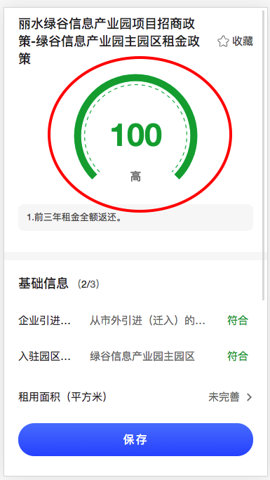

## CircleProgress

说明：
f2 chart 图

效果图:




```js
import F2 from '@antv/f2';
// import insertCss from 'insert-css';
import Taro, { Component } from '@tarojs/taro';
import { View } from '@tarojs/components';

import { fixF2 } from '@src/utils/f2-tool';
import { F2Canvas } from 'taro-f2';

import './circleProgress.less';

interface CircleProgressI {
  canvasId: string;
  percent: number;
  showText: string;
  color: string;
  bgColor: string;
  dashShow?: boolean;
  sizeCfg?: number; // f2 config 线条粗细
  padding: number | [] | string;
  lineDash: number[];
  appendPadding?: number | []; // f2 config https://f2.antv.vision/en/docs/api/chart/chart/#appendpadding
  startAngle?: number;
  endAngle?: number;
  percentFontSize?: number;
  showTextFontSize?: number;
  // dashRadius?: number,
  showTextFontColor?: string;
  percentFontColor?: string;
  percentTextPosition?: string[];
  showTextPosition?: string[];
}

export default class CircleProgress extends Component<CircleProgressI> {
  static defaultProps = {
    canvasId: '',
    percent: 0,
    showText: '政策匹配',
    color: '#eee',
    percentFontColor: '#eee',
    bgColor: '#eee',
    sizeCfg: 10,
    dashShow: true,
    startAngle: -1.25 * Math.PI,
    endAngle: 0.25 * Math.PI,
    percentFontSize: 45,
    showTextFontSize: 16,
    appendPadding: 0,
    padding: [20, 'auto', 0, 'auto'],
    percentTextPosition: ['50%', '50%'],
    showTextPosition: ['50%', '80%'],
    showTextFontColor: '#888',
    lineDash: [5, 5],
    scope: '',
  };
  // 组件内部变量
  private chart: F2.Chart = null;

  componentDidMount() {
    // const { appendPadding, padding, canvasId } = this.props
    // console.log(this.$scope, canvasId, process.env.TARO_ENV, '?????????????????')
    // let query
    // if (process.env.TARO_ENV === 'h5') {
    //   query = Taro.createSelectorQuery().in(this)
    // } else {
    //   query = Taro.createSelectorQuery().in(this.$scope)
    // }
    // query.select(`#${canvasId}`)
    //   .fields({ node: true, size: true })
    //   .exec((res) => {
    //     const {node, width, height} = res[0]
    //     const ctx = node.getContext('2d')
    //     console.log(node)
    //     const dpr = Taro.getSystemInfoSync().pixelRatio
    //     node.width = res[0].width * dpr
    //     node.height = res[0].height * dpr
    //     // ctx.scale(dpr, dpr)
    //     const config = { context: ctx, width, height, pixelRatio:dpr, appendPadding, padding };
    //     this.chart = this.onInitChart(F2, config);
    //   })
    // query.select(`#${canvasId}`).boundingClientRect().exec(res => {
    //   const context = Taro.createCanvasContext(canvasId, this.$scope);
    //   const width = res[0].width;
    //   const height = res[0].height;
    //   new Renderer(context, process.env.TARO_ENV);
    //   console.log('????????#######', context, height)
    //   fixF2(F2);
    //   const pixelRatio = Taro.getSystemInfoSync().pixelRatio;
    //   const config = { context, width, height, pixelRatio, appendPadding, padding };
    //   this.chart = this.onInitChart(F2, config);
    // });
  }
  componentWillReceiveProps(nexrprops) {
    if (this.chart && nexrprops.percent !== this.props.percent) {
      // 先清除图表 在进行绘制
      this.chart.clear();
      this.initRenderData(this.chart, nexrprops);
      // console.log(showText, color, bgColor,)
      // this.chart.changeData([
      //   { const: 'a', actual: percent, expect: 100}
      // ])
      // this.showTextRef.style= {
      //   fill: showTextFontColor, // 文本颜色
      //   fontSize:  showTextFontSize, // 文本大小
      //   fontWeight: 'bold', // 文本粗细
      // }

      // this.showTextRef.position = showTextPosition,
      // this.showTextRef.top= true,
      // this.showTextRef.content = 'hhhhhhh' || showText
      // this.showTextRef.repaint()
      // this.percentTextRef.top= true,
      // console.log(showTextPosition, percentTextPosition)
      // this.percentTextRef.position = percentTextPosition,
      // this.percentTextRef.style= {
      //   fill: 'red' || color, // 文本颜色
      //   fontSize: percentFontSize, // 文本大小
      //   fontWeight: 'bold', // 文本粗细
      // }
      // this.percentTextRef.content = `${percent}%`
      // this.percentTextRef.repaint()
    }
  }

  drawChart(config) {
    const { appendPadding, padding } = this.props;
    const { pixelRatio } = Taro.getSystemInfoSync();
    if (process.env.TARO_ENV !== 'h5') {
      fixF2(F2);
    }
    this.chart = this.onInitChart({ ...config, pixelRatio, appendPadding, padding });
  }
  // eslint-disable-next-line no-shadow
  onInitChart(config) {
    const { startAngle: startAngleProps, endAngle: endAngleProps, dashShow, lineDash } = this.props;
    const { Shape, G, Util, Global } = F2;
    const Vector2 = G.Vector2;

    // 极坐标下带圆角的柱子，只对极坐标生效
    Shape.registerShape('interval', 'polar-tick', {
      // getPoints(pointInfo) {
      //   console.log(pointInfo, '#####')
      // },
      draw: function draw(cfg, container) {
        const points = this.parsePoints(cfg.points);
        const style = Util.mix(
          {
            stroke: cfg.color,
          },
          Global.shape.interval,
          cfg.style,
        );

        let newPoints = points.slice(0);
        if (this._coord.transposed) {
          newPoints = [points[0], points[3], points[2], points[1]];
        }

        const center = cfg.center;
        const x = center.x,
          y = center.y;

        const v = [1, 0];
        const v0 = [newPoints[0].x - x, newPoints[0].y - y];
        const v1 = [newPoints[1].x - x, newPoints[1].y - y];
        const v2 = [newPoints[2].x - x, newPoints[2].y - y];

        let startAngle = Vector2.angleTo(v, v1);
        let endAngle = Vector2.angleTo(v, v2);
        const r0 = Vector2.length(v0);
        const r = Vector2.length(v1);

        if (startAngle >= 1.5 * Math.PI) {
          startAngle = startAngle - 2 * Math.PI;
        }

        if (endAngle >= 1.5 * Math.PI) {
          endAngle = endAngle - 2 * Math.PI;
        }

        const lineWidth = r - r0;
        const newRadius = r - lineWidth / 2;
        const dashRadius = cfg.size || 0;
        if (dashShow) {
          // 虚线
          container.addShape('Arc', {
            className: 'intervalDash',
            attrs: Util.mix(
              {
                x,
                y,
                startAngle: startAngleProps,
                endAngle: endAngleProps,
                r: newRadius - dashRadius,
                lineWidth: 1,
                lineDash: lineDash,
                lineCap: 'butt',
              },
              style,
            ),
          });
        }
        return container.addShape('Arc', {
          className: 'interval',
          attrs: Util.mix(
            {
              x,
              y,
              startAngle,
              endAngle,
              r: newRadius,
              lineWidth,
              lineCap: 'butt',
            },
            style,
          ),
        });
      },
    });

    const chart = new F2.Chart(config);
    this.initRenderData(chart);
    // chart.guide().html({
    //   position: [ '50%', '80%' ],
    //   html: `
    //     <div style="width: 120px;color: #fff;white-space: nowrap;text-align:center;">
    //       <p style="font-size: 18px;margin:0;">本月进度</p>
    //       <p id="text" style="font-size: 48px;margin:0;font-weight: bold;">0</p>
    //     </div>`
    // });
    // 注意：需要把chart return 出来
    return chart;
  }

  initRenderData(chart, newConfig = {}) {
    const { Util } = F2;
    const {
      percent,
      showText,
      color,
      bgColor,
      startAngle: startAngleProps,
      endAngle: endAngleProps,
      showTextFontColor,
      percentTextPosition,
      showTextPosition,
      showTextFontSize,
      percentFontSize,
      sizeCfg,
      percentFontColor,
    } = { ...this.props, ...newConfig };
    const data = [
      {
        const: 'a',
        actual: percent,
        expect: 100,
      },
    ];
    chart.source(data, {
      actual: {
        max: 100,
        min: 0,
        nice: true,
      },
    });
    chart.coord('polar', {
      transposed: true,
      innerRadius: 0.7,
      startAngle: startAngleProps,
      endAngle: endAngleProps,
    });
    chart.axis(false);
    chart
      .interval()
      .position('const*expect')
      .shape('polar-tick')
      .size(sizeCfg)
      .color(bgColor)
      .animate(false); // 背景条
    chart
      .interval()
      .position('const*actual')
      .shape('polar-tick')
      .size(sizeCfg)
      .color(color)
      .animate(false);
    // .animate({
    //   appear: {
    //     duration: 1100,
    //     easing: 'linear',
    //     animation: function animation(shape, animateCfg) {
    //       const startAngle = shape.attr('startAngle');
    //       let endAngle = shape.attr('endAngle');
    //       if (startAngle > endAngle) {
    //         // -Math.PI/2 到 0
    //         endAngle += Math.PI * 2;
    //       }
    //       shape.attr('endAngle', startAngle);
    //       shape
    //         .animate()
    //         .to(
    //           Util.mix(
    //             {
    //               attrs: {
    //                 endAngle,
    //               },
    //             },
    //             animateCfg,
    //           ),
    //         )
    //         // .onUpdate();
    //     },
    //   },
    // }); // 实际进度
    chart.guide().text({
      top: true, // 指定 guide 是否绘制在 canvas 最上层，默认为 true, 即绘制在最上层
      position: showTextPosition, // 文本的起始位置，值为原始数据值，支持 callback
      content: showText, // 显示的文本内容
      style: {
        fill: showTextFontColor, // 文本颜色
        fontSize: showTextFontSize, // 文本大小
        fontWeight: 'bold', // 文本粗细
      }, // 文本的图形样式属性
    });
    chart.guide().text({
      top: true, // 指定 guide 是否绘制在 canvas 最上层，默认为 true, 即绘制在最上层
      position: percentTextPosition, // 文本的起始位置，值为原始数据值，支持 callback
      content: typeof percent === 'number' ? percent : '-', // 显示的文本内容
      style: {
        fill: color || percentFontColor, // 文本颜色
        fontSize: percentFontSize, // 文本大小
        fontWeight: 'bold', // 文本粗细
      }, // 文本的图形样式属性
    });
    chart.render();
  }

  htmlCanvas(canvas) {
    // eslint-disable-next-line @typescript-eslint/no-this-alias
    const that = this;
    const { canvasId } = this.props;
    if (!canvas) return;
    // canvas width height 为什么会变化？
    const query = Taro.createSelectorQuery().in(this);
    query
      .select(`#${canvasId}`)
      .boundingClientRect()
      .exec((res) => {
        if (res && res[0]) {
          const width = res[0].width;
          const height = res[0].height;
          setTimeout(() => {
            that.drawChart({ context: canvas.getContext('2d'), width, height });
          }, 1);
        }
      });
  }

  render() {
    const { canvasId } = this.props;
    return (
      <View className='circle-chart-container' id={canvasId}>
        {process.env.TARO_ENV === 'h5' && (
          <canvas ref={this.htmlCanvas.bind(this)} className={'f2-canvas ' + canvasId}></canvas>
        )}
        {process.env.TARO_ENV !== 'h5' && (
          <F2Canvas
            onCanvasInit={(canvas, width, height) => {
              const context = canvas.getContext('2d');
              this.drawChart({ context, width, height });
            }}
          ></F2Canvas>
        )}
        {/* <Canvas
          type='2d'
          id={canvasId}
          canvasId={canvasId}
          className='f2-canvas'
        >
        </Canvas> */}
      </View>
    );
  }
}

```
