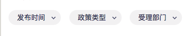

## ConditionPicker

效果图:



```js
import { FunctionComponent } from "react";
import Taro from '@tarojs/taro'
import { View, Picker } from "@tarojs/components";

import IconFont from '@src/components/iconfont'

import './index.less';

type Condition = {
  type: string
 range: any[]
  value: number
  rangeKey: string
  slectedFlag: boolean,
  showText: string
}
export interface ConditionPickerI {
  conditions: Condition[]
  onChange: (string, event) => void
}

const ConditionPicker: FunctionComponent<ConditionPickerI> = (props: ConditionPickerI) => {
  const { conditions=[], onChange } = props
  function changePicker(params, e) {
    onChange(params, e)
  }
  return (
    <View className='policy-type-list'>
      {
        conditions.map(item => {
          return <View className='policy-item' key={item.type}>
            <Picker mode='selector' range={item.range} value={item.value} rangeKey={item.rangeKey}
              onChange={changePicker.bind(null, item.type)}
            >
              <View className={`picker ${item.slectedFlag ? 'selected' : ''}`}>
                <View className='picker-text ellipse'>
                  {item.showText}
                </View>
                <View className='rotate-180 ml-5'>
                  <IconFont name='xiangshang' size={18} color={item.slectedFlag ? '#4D75FF': '#3B416B'} />
                </View>
              </View>
            </Picker>
          </View>
        })
      }
    </View>
  )
}

export default ConditionPicker
```

More skills for writing demo: https://d.umijs.org/guide/demo-principle
