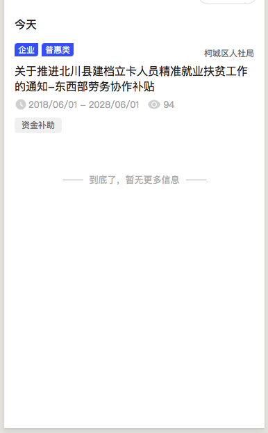

## ListPage

说明：
小程序端-列表，下拉加载更多功能
具体页面代码

效果图:




```js
import Taro, { Component, Config } from '@tarojs/taro'
import { View } from '@tarojs/components'
import ComponentResumeList from '@src/components/resumeList'
import ListRender from '@src/components/listRender'
import gotoPageGlobal from '@src/utils/gotoPageGlobal'

import {API_ACCOUNT_DELIVER_LIST} from '@src/constants/api'

import './index.less'


type PageState = {}

type IProps = PageState

interface Index {
  props: IProps;
}
// const ResumeList = ListHOC(ComponentMatchedList, {})
// console.log(ResumeList, '????????????????/sdfsfsfsfsdf')

class Index extends Component {
  /**
   * 指定config的类型声明为: Taro.Config
   *
   * 由于 typescript 对于 object 类型推导只能推出 Key 的基本类型
   * 对于像 navigationBarTextStyle: 'black' 这样的推导出的类型是 string
   * 提示和声明 navigationBarTextStyle: 'black' | 'white' 类型冲突, 需要显示声明类型
   */
  state = {
    loadMore: false,
    total: 0,
    currentArray: []
  }
  componentDidMount() {
  }

  componentWillReceiveProps (nextProps) {
  }

  componentWillUnmount () {
  }

  config: Config = {
    navigationBarTitleText: '投递记录',
    usingComponents: {
      // "component-matched-list": '../../components/matchedList',
    }
  }
  componentDidShow () {

  }
  // onShareAppMessage(){
  //   return getShareMsg()
  // }
  componentDidHide () { }
  onReachBottom() {
    const { total, currentArray } = this.state
    if(total <= currentArray.length) {
      return false
    }
    this.setState({
      loadMore: true
    })
  }
  loadOver = (params) => {
    this.setState({
      ...params,
      loadMore: false
    })
  }
  gotoPage = (id) => {
    const params = {
      url: `/packageRecruit/recruitDetail/index?id=${id}&from=myResumeList`
    }
    gotoPageGlobal(params)
  }
  render () {
    const { loadMore, currentArray } = this.state
    const resumeProps = {
      fetchUrl:API_ACCOUNT_DELIVER_LIST,
      fetchMethod:'get',
      loadMore,
      onLoadOver: this.loadOver,
      nodataText: '暂无投递记录'
    }
    return (
      <View className='container'>
        <ListRender
          // renderCat={<View>nihaoaaaaaaa</View>}
          // renderList={(params) =>{
          //   console.log(params, '11111111############')
          //   return <View>nihaoaaaaaaa</View>}}
          // return <ComponentMatchedList matchedList={params.listArray}  {...params}></ComponentMatchedList>}}
          {...resumeProps}
        >
          <View className='list-container'>
            <ComponentResumeList list={currentArray} onGotoPage={this.gotoPage}></ComponentResumeList>
          </View>
        </ListRender>
      </View>
    )
  }
}

// #region 导出注意
//
// 经过上面的声明后需要将导出的 Taro.Component 子类修改为子类本身的 props 属性
// 这样在使用这个子类时 Ts 才不会提示缺少 JSX 类型参数错误
//
// #endregion

export default Index

```
