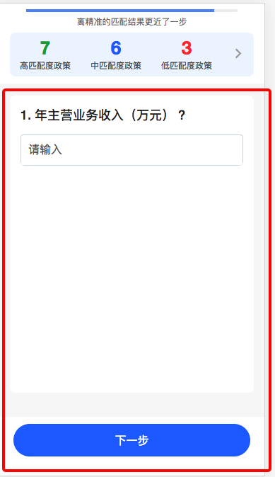

## StepSelect

说明：
上一步、下一步完善问题

效果图:




```js
import Taro, { useEffect, useState } from '@tarojs/taro';
import {
  View,
  Input,
  RadioGroup,
  Radio,
  Label,
  CheckboxGroup,
  Checkbox,
  Image,
} from '@tarojs/components';
import ModalMask from '@src/components/maskModal';
import IconFont from '@src/components/iconfont';

import loadingMatchGif from '@src/images/loadingMatch.gif';

import { isNotCompleteNumber } from '@src/utils/vertify';

import './index.less';

const getItem = (props) => {
  const { data, onChange, value } = props;
  const { type, placeholder, valueType } = data;
  const option = data.option || []; // opiton 有时为null，此时取不到默认值
  let node = <View></View>;
  const commonStyle = {
    display: 'flex',
    alignItems: 'center',
    // height: '30px',
    // lineHeight: '30px',
    // marginLeft: 0,
  };
  switch (type) {
    // 输入框
    case 'INPUT_TEXT_NORMAL':
    case 'INPUT_TEXT_POP':
      const eventProps =
        valueType === 'NUMBER'
          ? {
              onBlur: onChange,
            }
          : {
              onInput: onChange,
            };
      node = (
        <Input
          type={valueType === 'NUMBER' ? 'number' : 'text'}
          value={value}
          className='input-select'
          placeholderClass='placeholder-style'
          {...eventProps}
          placeholder={placeholder || '请输入'}
        />
      );
      break;

    // 单选框
    case 'INPUT_RADIO':
      node = (
        <View>
          {option.map((item) => (
            <View
              key={item.label || item}
              className='radio-select'
              onClick={() => onChange({ detail: { value: item.value || item } }, item.key)}
            >
              <IconFont
                name={value === (item.value || item) ? 'danxuanb' : 'danxuana'}
                color='#277eff'
                size={48}
              />
              <View className='radio-text'>{item.label || item}</View>
            </View>
          ))}
        </View>
      );
      // node = (
      //   <RadioGroup onChange={onChange}>
      //     {option.map((item) => (
      //       <Label key={item.label || item} className='radio-select'>
      //         <Radio style={commonStyle} value={item.value || item}>
      //           {item.label || item}
      //         </Radio>
      //       </Label>
      //     ))}
      //   </RadioGroup>
      // );
      break;

    // 多选框
    case 'INPUT_CHECKBOX':
      node = (
        <CheckboxGroup onChange={onChange}>
          {option.map((item) => (
            <Label key={item.label || item}>
              <Checkbox
                color='#fff'
                checked={value && value.indexOf(item.value || item) !== -1}
                style={commonStyle}
                value={item.value || item}
              >
                {item.label || item}
              </Checkbox>
            </Label>
          ))}
        </CheckboxGroup>
      );
      break;
  }
  return node;
};

type StepSelectProps = {
  list: any[];
  onChange?: (parmas: any) => void;
  onComlete?: () => void;
  percent?: number;
  btnStyle?: object;
  showSave?: boolean;
};
const StepSelect = (props: StepSelectProps) => {
  const { list = [], onChange, percent, btnStyle, showSave, onComlete } = props;
  const [currentStep, setCurrentStep] = useState(0);
  const [loading, setLoading] = useState(false);
  const initObj: any = {};
  const [formValues, setFromValues] = useState(initObj);

  const getNextQuestion = (allValues) => {
    if (currentStep === list.length - 1) {
      onChange && onChange(allValues);
      if (percent !== 100) {
        setLoading(true);
      }
    }
  };

  // 点击上一步，下一步操作
  // type 类型为radio时，由于直接进行请求，此时 formValues 值暂未更新，因此需要单独传入
  const handleStep = (type: string, allValues?: object) => {
    const nextFlag = type === 'next';
    if (nextFlag) {
      // 修改值不能为空
      const value2 = allValues || formValues;
      // 获取当前问题答案
      const key = list[currentStep] && list[currentStep].key;
      const notEmptyValue = (key && value2[key]) || '';
      const emptyFlag = notEmptyValue.length;
      if (!emptyFlag) {
        return Taro.showToast({
          title: '录入值不能为空',
          icon: 'none',
          duration: 2000,
        });
        // return message.error('录入值不能为空');
      }
      getNextQuestion(value2);
    }
    const unit = nextFlag ? 1 : -1;
    if (percent === 100 && nextFlag && currentStep === list.length - 1) {
      Taro.showToast({
        title: '已匹配完成！',
        icon: 'success',
      });

      onComlete && onComlete();
    } else {
      setCurrentStep(currentStep + unit);
    }
  };
  // onBlur 失去焦点时对input值进行校验
  // 不过浏览器对 input type = number 会自动校验
  const onBlur = (item, e) => {
    let { value } = e.target;
    let flag;
    if (value) {
      flag = isNotCompleteNumber(parseFloat(value, 10));
      value = flag ? '' : parseFloat(value, 10) + '';
    }
    const allValues = {
      ...formValues,
      [item.key]: value,
    };
    setFromValues(allValues);
  };
  const onItemChange = (item, e) => {
    const { key, type } = item;
    let { value } = e.detail;
    if (value instanceof Array && formValues[key]) {
      if (value[value.length - 1] === '以上均无' && formValues[key].indexOf('以上均无') === -1) {
        // 已选别的选项后选择以上均无
        value = ['以上均无'];
      } else if (formValues[key][0] === '以上均无' && value.length > 1) {
        // 已选以上均无后选择别的选项
        value.pop();
      }
    }
    const allValues = {
      ...formValues,
      [key]: value,
    };
    if (type === 'INPUT_RADIO' && !showSave) {
      handleStep('next', allValues);
    }
    setFromValues(allValues);
  };
  const onValuesChange = (changedValues, allValues) => {
    setFromValues({
      changedValues,
      allValues,
    });
    // INPUT_RADIO 直接跳转下一步
    const changedKey = Object.keys(changedValues)[0] || '';
    const changeItem = list.find((item) => item.key === changedKey) || {};
    if (changeItem.type === 'INPUT_RADIO') {
      handleStep('next', allValues);
    }
  };
  useEffect(() => {
    if (list.length > currentStep || percent === 100) {
      setLoading(false);
    }
    // 暂无更多，但是已经进入下一步，需要回退到上一步
    if (list.length === currentStep && percent === 100) {
      setCurrentStep(currentStep - 1);
      Taro.showToast({
        title: '已匹配完成！',
        icon: 'success',
      });

      onComlete && onComlete();
    }
    // eslint-disable-next-line react-hooks/exhaustive-deps
  }, [list.length, percent]);
  return (
    <View className='step-select-com-container'>
      <View className='step-select-detail'>
        {list.map((item, index) => {
          return (
            <View
              className={`step-select-item ${showSave ? 'height-auto' : 'height0'} ${
                currentStep === index ? 'current' : ''
              }`}
              key={'index' + index}
            >
              <View className='step-select-item-label'>{`${index + 1}. ${item.key} ?`}</View>
              <View className='step-select-item-value'>
                {getItem({
                  data: item,
                  onChange: onItemChange.bind(null, item),
                  // value: formValues[item.key] || item.value,
                  value: formValues[item.key],
                })}
              </View>
            </View>
          );
        })}
      </View>
      {!showSave && (
        <View className='handle-parent' style={btnStyle}>
          {currentStep !== 0 && (
            <View
              className='submit-default'
              onClick={() => {
                handleStep('prev');
              }}
            >
              上一步
            </View>
          )}
          <View
            className='submit-primary'
            onClick={() => {
              handleStep('next');
            }}
          >
            下一步
          </View>
        </View>
      )}
      {showSave && list.length > 0 && (
        <View className='handle-parent' style={btnStyle}>
          <View
            className='submit-primary'
            onClick={() => {
              onChange && onChange(formValues);
            }}
          >
            保存
          </View>
        </View>
      )}
      {/* 匹配中弹窗start */}
      <ModalMask selectModal={loading} onCloseModal={() => {}}>
        <Image src={loadingMatchGif} className='loading-img' />
        <View className='loading-text'>匹配中~</View>
      </ModalMask>
      {/* 匹配中弹窗end */}
    </View>
  );
};

StepSelect.options = {
  addGlobalClass: true,
};
export default StepSelect;


```


```less
@hd=2;

.step-select-com-container {
  .radio-select {
    display: flex;
    align-items: center;
  }
  .radio-text {
    padding-left: 14px*@hd;
  }
  .input-select {
    box-sizing: border-box;

    line-height: 44px * @hd;
    height: 44px * @hd;
    padding: 0 10px * @hd;
    margin-top: 15px*@hd;
    font-size: 16px * @hd;
    background: #ffffff;
    border: 1px * @hd solid #d8e0e8;
    border-radius: 4px * @hd;
  }
  .step-select-detail {
    min-height: 390px*@hd;
    padding: 15px*@hd 15px*@hd;
    background: #ffffff;
    border-radius: 8px*@hd;
  }
  .step-select-item {
    // background: #fff;
    border-radius: 6px * @hd;
    // box-shadow: 0px * @hd 8px * @hd 16px * @hd 0px * @hd rgba(172, 172, 172, 0.06);
    overflow: hidden;
    &.height-auto {
      height: auto;
      margin-bottom: 24px * @hd;
    }
    &.height0 {
      height: 0
    }
    &.current {
      min-height: 80px * @hd;
      height: auto;
      // padding: 20px * @hd;
      box-sizing: border-box;
      margin-bottom: 24px * @hd;
    }
  }
  .step-select-item-label {
    font-size: 18px*@hd;
    font-weight: 500;
    text-align: left;
    color: #333333;
    line-height: 26px*@hd;
    margin-bottom: 5px*@hd;
  }
  .step-select-item-value {
    font-size: 14px*@hd;
    text-align: left;
    color: #666666;
    line-height: 40px*@hd;
  }

  // submit start
  .handle-parent {
    position: fixed;
    box-sizing: border-box;
    left: 0;
    bottom: 0;
    width: 100%;
    padding: 10px*@hd 20px*@hd 27px*@hd;
    background: #fff;
    z-index: 11;

    display: flex;
    font-size: 16px*@hd;
    font-weight: 500;
    text-align: center;
  }
  .submit-default {
    width: 125px*@hd;
    color: #277eff;
    height: 46px*@hd;
    line-height: 46px*@hd;
    cursor: pointer;
    border: 1px*@hd solid #277eff;
    border-radius: 23px*@hd;
    margin-right: 20px*@hd;
  }
  .submit-primary {
    cursor: pointer;
    height: 46px*@hd;
    line-height: 46px*@hd;
    flex: 1;
    background: #277eff;
    border-radius: 23px*@hd;
    color: #fff;
  }
  // submit end

  // checkbox radio 样式重写
  .taro-checkbox_checked {
    border: 2px*@hd solid #277eff;
    border-radius: 3px*@hd;
    margin-right: 14px*@hd;
    top: 0;
    &:checked {
      background: #277eff;
    }
  }

  // 弹窗样式修改
  .modal-mask .fixed-modal-content {
    width: 122px*@hd;
    height: 122px*@hd;
    font-size: 0;
    top: 50%;
    left: 50%;
    transform: translate(-50%, -50%);
    border-radius: 16px*@hd;
    text-align: center;
    box-sizing: border-box;
    padding-top: 27px*@hd;
    .loading-img {
      width: 46px*@hd;
      height: 46px*@hd;
    }
    .loading-text {
      margin-top: 12px*@hd;
      font-size: 14px*@hd;
      font-weight: 400;
      color: #666666;
      line-height: 20px*@hd;
    }
  }
}

```
